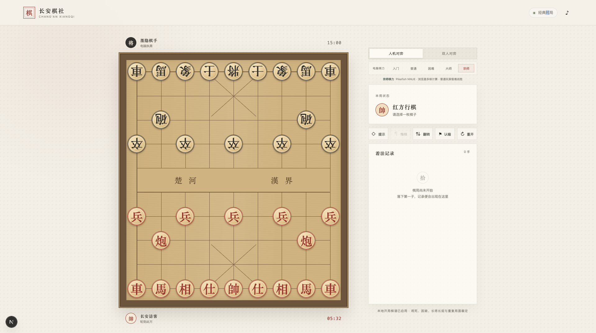

# 长安棋社 · 中国象棋


<p align="center">
  <strong>一局安静、讲究、随时可开的中国象棋。</strong><br />
  完整规则、多档棋力、Pikafish NNUE，以及适配桌面端和移动端的浏览器对弈体验。
</p>

<p align="center">
  
  
  
  
</p>

## 项目简介

长安棋社是一个使用官方 Next.js App Router 开发的中国象棋游戏。棋局规则、电脑搜索、Pikafish 引擎和棋谱记录均在浏览器内运行，不需要数据库或后端计算服务。

项目不仅关注“能下棋”，也重视完整裁定、思考反馈、落子手感和棋局回顾。界面以中式棋社为视觉方向，并带有“代码工匠 · 用代码打磨每一步”的品牌标识。

## 界面预览



> 桌面端实际对局界面：棋盘、棋力选择、本局状态与着法记录保持在同一视野内。

## 功能亮点

- 人机对弈与本地双人对弈
- 入门、普通、困难、大师、宗师五档棋力
- 严格处理马腿、象眼、炮架、九宫、过河兵卒和将帅照面
- 检测送将、将军、将死、困毙与擒将
- 支持重复局面、长将、长捉、自然限着和无进攻子力和棋裁定
- 本地开局库，覆盖中炮、屏风马、仙人指路和飞相局等常见谱线
- 着法记录、棋局回顾、逐手复盘、悔棋、视角翻转和推荐着法
- 落子与吃子音效、移动轨迹、胜负动画和思考状态反馈
- 棋子严格落在棋盘线交叉点，响应式适配 PC 与移动设备
- Web Worker 后台搜索，避免电脑思考时阻塞棋盘交互
- 完全在浏览器运行，不上传棋局数据

## 棋力等级

| 难度 | 计算方式 | 适合人群 |
| --- | --- | --- |
| 入门 | 最高约 2 层，200～350ms 搜索预算 | 初次接触象棋 |
| 普通 | 最高约 4 层，500ms～1 秒搜索预算 | 日常休闲对弈 |
| 困难 | 最高约 10 层，最多思考 3 秒 | 有一定经验的玩家 |
| 大师 | Pikafish + NNUE + WebAssembly，最多思考 5 秒 | 希望获得更强挑战的玩家 |
| 宗师 | Pikafish + NNUE + WebAssembly，最多思考 10 秒 | 高强度对弈与引擎体验 |

内置搜索引擎使用迭代加深、Alpha-Beta 剪枝、静态搜索、置换表、Zobrist 哈希、杀手着法和历史启发。大师和宗师难度会切换到浏览器版 Pikafish，并使用 NNUE 网络评估局面。

搜索预算会随剩余棋时缩短，紧急读秒时可低于上述范围；命中开局库或提前完成搜索时会更快落子。

## 技术栈

- Next.js 16（App Router）
- React 19
- TypeScript 5
- Web Worker
- WebAssembly
- Pikafish + NNUE
- 原生 CSS 动画与响应式布局

## 本地运行

环境要求：

- Node.js 22.13 或更高版本
- npm

安装并启动开发环境：

```bash
npm install
npm run dev
```

浏览器访问 [http://localhost:3000](http://localhost:3000)。

生产构建：

```bash
npm run build
npm start
```

代码检查：

```bash
npm run lint
```

## 部署到 Vercel

项目使用官方 Next.js，可直接通过 Vercel 部署，不需要额外的适配器或 `vercel.json`。

1. 将仓库推送到 GitHub、GitLab 或 Bitbucket。
2. 在 Vercel 中导入仓库。
3. 保持自动识别的 `Next.js` Framework Preset。
4. 使用默认安装命令和构建命令完成首次部署。
5. 添加生产环境变量并重新部署：

```text
NEXT_PUBLIC_SITE_URL=https://你的正式域名
```

该变量用于生成正确的 Open Graph 和社交分享地址。未配置时，本地开发默认使用 `http://localhost:3000`。

## NNUE 文件说明

大师和宗师难度使用下面的神经网络权重文件：

```text
public/nnue/pikafish-9e20a9a44415.nnue
```

文件大小约 49 MiB，首次进入大师或宗师模式时需要下载。项目已为该资源设置长期缓存，因此同一浏览器后续通常无需重复下载。其他三档棋力不依赖该文件。

Pikafish 多线程运行依赖跨源隔离能力。项目已经在 [`next.config.ts`](./next.config.ts) 中配置 COOP、COEP 和 NNUE 缓存响应头。

## 项目结构

```text
.
├── app/
│   ├── globals.css            # 全局样式、响应式布局与动画
│   ├── layout.tsx             # 页面布局和社交分享元数据
│   └── page.tsx               # 对局状态与交互流程
├── components/
│   └── chess-board.tsx        # 棋盘、棋子和键盘操作
├── lib/
│   ├── ai-client.ts           # AI 难度、Worker 调度和降级处理
│   ├── chess.ts               # 象棋规则、裁定、开局库与搜索引擎
│   └── pikafish.ts            # Pikafish 生命周期与协议封装
├── workers/
│   └── chess-ai.worker.ts     # 内置 AI 后台搜索入口
└── public/
    ├── js/worker/             # Pikafish JavaScript 与 WASM
    ├── nnue/                  # NNUE 网络权重
    └── third-party/pikafish/  # 第三方作者、源码与许可说明
```

## 浏览器兼容性

建议使用较新的 Chrome、Edge、Firefox 或 Safari。浏览器需要支持 Web Worker 和 WebAssembly；若运行环境不支持 Pikafish 引擎，游戏会自动回退到内置困难兼容模式。

## 第三方许可

项目包含 Pikafish 相关的 JavaScript、WebAssembly 和 NNUE 文件。Pikafish 使用 GNU GPL v3，具体构建来源、校验值和附加说明请查看：

- [`public/third-party/pikafish/SOURCE.md`](./public/third-party/pikafish/SOURCE.md)
- [`public/third-party/pikafish/Copying.txt`](./public/third-party/pikafish/Copying.txt)
- [`public/third-party/pikafish/AUTHORS`](./public/third-party/pikafish/AUTHORS)

仓库正式公开前，请根据实际发布方式补充项目自身的根目录 `LICENSE` 文件。

## 参与开发

欢迎通过 Issue 提交规则问题、浏览器兼容性问题或棋力改进建议。提交代码前建议运行：

```bash
npm run lint
npm run build
```

---

<p align="center"><strong>代码工匠 · 用代码打磨每一步</strong></p>
